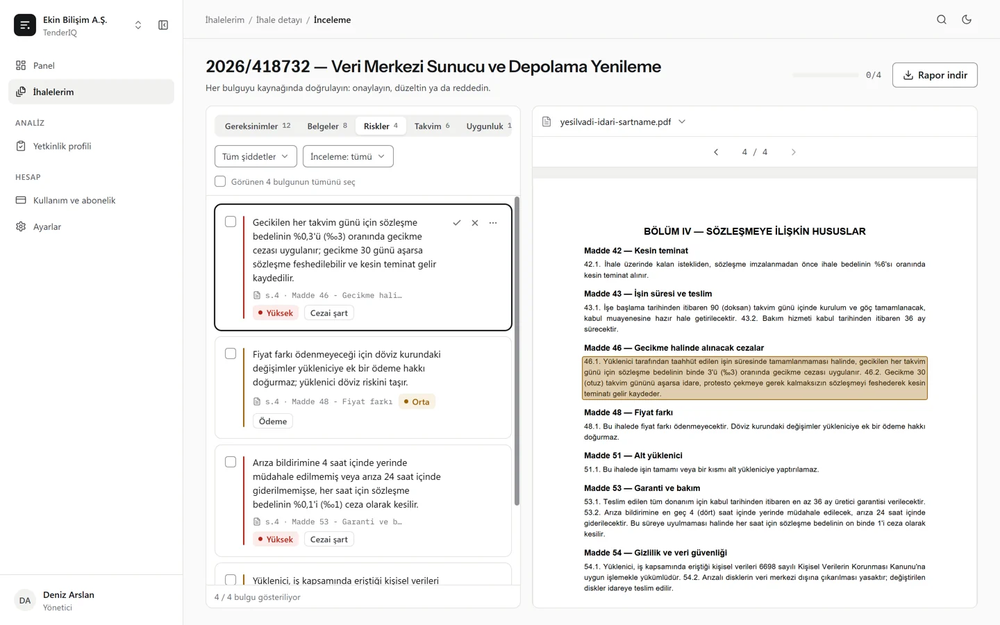
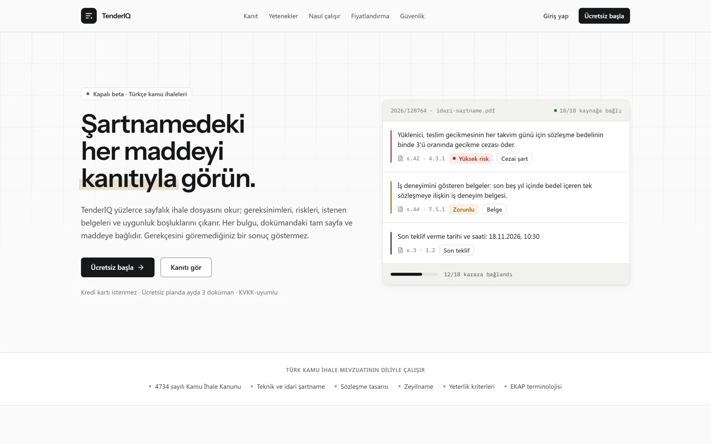
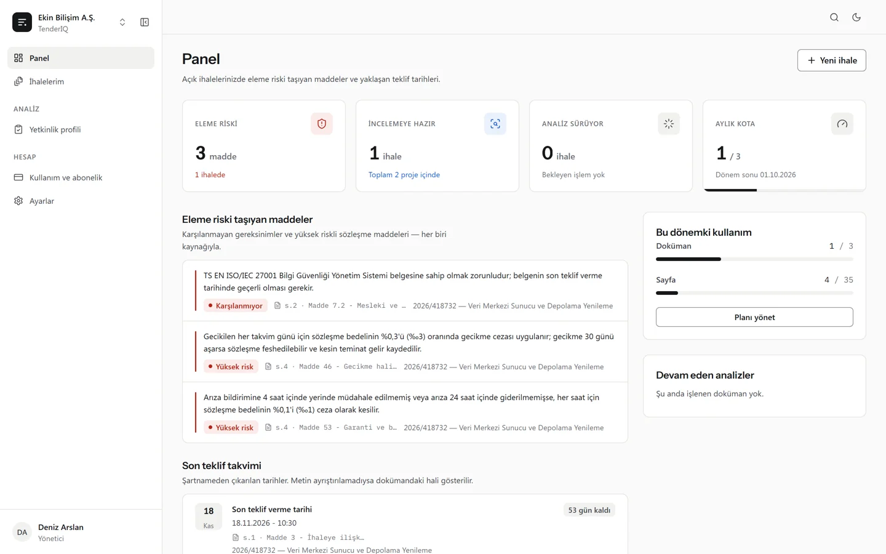
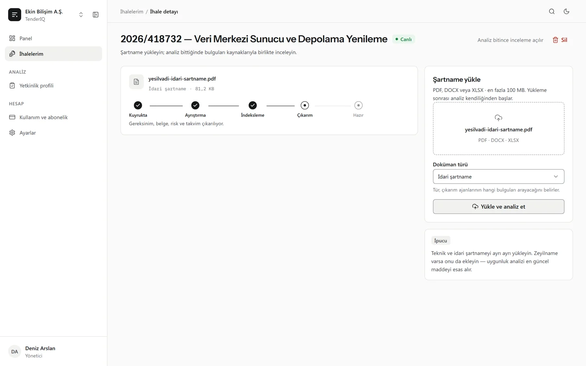
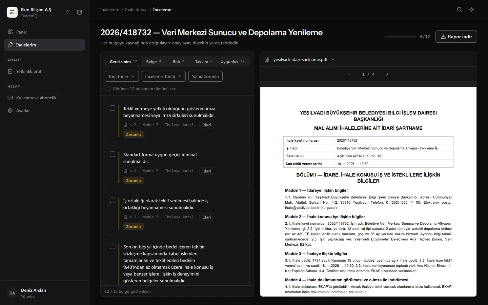

# TenderIQ

**Türkçe kamu ihalesi şartnamelerini kaynağına kadar izlenebilir biçimde analiz eden AI platformu.**

Bir teklif ekibi 300 sayfalık bir şartnameyi okurken tek bir soruya cevap arar: *"Bu dokümanda
beni eleyecek ya da riske atacak madde hangisi, ve tam olarak nerede yazıyor?"* TenderIQ şartnameyi
okur; gereksinimleri, istenen belgeleri, riskli sözleşme maddelerini, takvimi ve firmanın uygunluk
boşluklarını çıkarır. **Her bulgu doküman + sayfa + madde referansıyla gelir** ve inceleme
ekranında orijinal PDF'in üzerinde vurgulanır. Kaynağına bağlanamayan bir bulgu rapora hiç girmez.

Çok kiracılı, KVKK'ya göre tasarlanmış bir SaaS: kiracı izolasyonu veritabanı satır düzeyinde
(PostgreSQL RLS), yüklenen dokümanlar model eğitiminde kullanılmaz, her inceleme kararı denetim
izine yazılır.



## Ne yapar

| | |
|---|---|
| **Hibrit ayrıştırma** | Dijital PDF, taranmış PDF (OCR), DOCX ve XLSX. Sayfa bazında dijital/taranmış yönlendirme (Docling + pypdf + EasyOCR). |
| **Kaynağa bağlı çıkarım** | Beş uzman ajan (gereksinim, belge, risk, takvim, uygunluk) LangGraph ile tek akışta çalışır. Her bulgu kaynak pasaja *grounding* ile bağlanır; bağlanamayan bulgu reddedilir. |
| **Hibrit getirim** | BGE-M3 yoğun vektör + BM25, RRF füzyonu ve yeniden sıralama (pgvector). |
| **İnsan-döngüde inceleme** | Onayla / düzelt / reddet, toplu işlem, yorum ve değişiklik geçmişi. Her karar geri alınabilir ve denetim izine yazılır. |
| **Rapor** | Onaylı bulgular kaynak referanslarıyla Word ve Excel'e aktarılır. |
| **İşletme katmanı** | Organizasyon, üyelik, davet, rol yönetimi; abonelik ve kota; kiracı başına LLM bütçe tavanı (Redis rezervasyonlu, yarışa dayanıklı). |

## Mimari

Monorepo: `apps/*` ince giriş noktaları, paylaşılan Python mantığı `packages/core`'da. Frontend
backend'e yalnız OpenAPI'dan üretilen `packages/api-client` üzerinden erişir; sözleşme kayması CI'da
yakalanır.

```
yükleme ──► R2 (imzalı URL) ──► Celery hattı ──────────────────────────────► inceleme UI
                                 parse → chunk → embed → getir → ajanlar
                                                              → grounding → bulgu (RLS)
```

| Katman | Teknoloji |
|---|---|
| Frontend | Next.js 15 (App Router) · React 19 · TypeScript strict · Tailwind v4 · shadcn/ui · TanStack Query · react-pdf |
| API | FastAPI (async) · `/api/v1` · SSE canlı durum · tutarlı hata modeli |
| Worker | Celery + Redis — durum makineli, idempotent işleme hattı |
| Veri | PostgreSQL 16 + pgvector · RLS ile kiracı izolasyonu · Redis · Cloudflare R2 |
| AI | Docling · BGE-M3 · LangGraph · Claude (üretim) · NVIDIA NIM / Ollama (geliştirme) · Langfuse |
| Kalite | Ruff · mypy strict · pytest + testcontainers · Playwright E2E · Lighthouse a11y · gitleaks · pip-audit · trivy |

Mimari kararlar [`docs/adr/`](docs/adr/) altında (13 ADR): RLS çok kiracılık, hibrit ayrıştırma,
LangGraph orkestrasyonu, hibrit getirim, KVKK yurt dışı aktarım, abonelik yönetimi.

## Yapay zekâ ile nasıl geliştirildi

TenderIQ tek geliştirici tarafından, Claude Code ile eşli çalışılarak geliştirildi (75 commit'in 73'ü
ortak yazarlı). Yöntem, AI'ın hızını kalıcı sözleşmelerle dengelemek üzerine kurulu:

- **Kurallar kodda, hafıza dosyada.** `CLAUDE.md` bağlayıcı kuralları, `docs/ops/DURUM.md` her
  oturumun tek giriş noktasını (kalıcı gerçekler, tuzaklar, doğrulanmamış varsayımlar) taşır.
- **Tasarım sözleşmesi.** `DESIGN.md` brif, token sistemi ve "anti-slop" kurallarını tanımlar;
  her UI görevi Playwright ile dört ekran genişliğinde görsel doğrulama döngüsünden geçer
  (`scripts/shoot.mjs`, `.claude/commands/ui-*`).
- **Ölçülebilir AI kalitesi.** Golden-set değerlendirmesi prompt/model değişiminde CI'ı bloke eder;
  grounding zorunluluğu ve şema reddi kodda sabittir.
- **Kararlar kayıtlı.** Her mimari seçim ADR olarak, her tasarım turu `design/decisions.md`'ye yazılır.

## Kurulum

**Önkoşullar:** Python 3.12+ ve [uv](https://docs.astral.sh/uv/) · Node 22+ ve pnpm · Docker

```bash
git clone https://github.com/Scryne/TenderIQ.git && cd TenderIQ
cp .env.example .env          # sırları doldurun; boş bırakılan isteğe bağlı alanlar uyarıyla açılır

# Backend — worker PDF ayrıştırma ve embedding yığınına ihtiyaç duyar (torch dahil, büyük)
uv sync --all-packages --group parsing --group embedding --group ocr

# Altyapı + migration
docker compose -f infra/compose/docker-compose.yml up -d postgres redis
uv run alembic upgrade head

# Servisler (ayrı terminallerde)
pnpm api:dev                  # http://localhost:8000/docs
pnpm worker:dev
pnpm install && pnpm web:dev  # http://localhost:3000
```

Bilinmesi gerekenler:

- **Tarayıcı adresi `localhost:3000` olmalı.** Dosyalar tarayıcıdan doğrudan R2'ye yüklenir; bucket'ın
  CORS kuralı bu origin'e göre yazılır. `127.0.0.1` ile açılırsa yükleme CORS'a takılır.
- **Web üretim derlemesi `NEXT_PUBLIC_STORAGE_ORIGIN` ister** ve bu değişken derleme anında verilir
  (CSP `connect-src` buna göre üretilir). Eksikse derleme bilerek durur.
- **Windows'ta API `--reload` ile çalışır** (`pnpm api:dev` bunu yapar). Reload'suz olay döngüsü
  async psycopg ile çalışmaz.
- **Tam Docker:** `pnpm up` / `pnpm down` tüm servisleri imajlarıyla kaldırır.
- RLS: uygulama `tenderiq_app` rolüyle (RLS'ye tabi), migration'lar ayrıcalıklı rolle çalışır (ADR-0003).

## Komutlar

| Komut | İşlev |
|---|---|
| `pnpm lint:py` · `pnpm typecheck:py` · `pnpm test:py` | Ruff · mypy strict · pytest (birim) |
| `uv run pytest -m integration` | Gerçek Postgres/Redis ile entegrasyon testleri (testcontainers) |
| `pnpm web:lint` · `pnpm web:typecheck` · `pnpm web:build` | Frontend kalite kapıları |
| `pnpm test:e2e` | Playwright tarayıcı akışları |
| `pnpm openapi:export` · `pnpm api-client:generate` | Tip-güvenli API sözleşmesini yeniden üret |
| `uv run python scripts/seed_e2e.py` | İncelemeye hazır bir demo ihalesi tohumla |

## Durum

| Faz | Kapsam | Durum |
|---|---|---|
| 0 | Monorepo, auth + RLS, yükleme, ayrıştırma spike'ı | ✅ 2026-07-04 |
| 1 | İşleme hattı (parse → chunk → embed → index) + golden-set | ✅ 2026-07-17 |
| 2 | Çıkarım ajanları + zorunlu grounding + eval kapısı | ✅ 2026-07-19 |
| 3 | İnceleme UI + kaynak vurgusu + export + abonelik + hesap yaşam döngüsü | ✅ 2026-07-24 |
| 4 | Kapalı beta: trust/KVKK/DPA sayfaları, hard-delete, iyzico adaptörü, LLM bütçe tavanı | 🔄 ürün tarafı tamam; gerçek müşteri, canlı ödeme ve hukuki metinlerin şirket bilgileri bekliyor |
| GA | Dağıtım, DR, SLO, yasal-ticari kontrol listeleri | ⏳ |

Ayrıntı: [`GELISTIRME_PLANI.md`](GELISTIRME_PLANI.md) · operasyon gerçeği:
[`docs/ops/DURUM.md`](docs/ops/DURUM.md) · hukuki eksikler: [`LEGAL_TODO.md`](LEGAL_TODO.md).

## Ekranlar

| | |
|---|---|
|  |  |
|  |  |

Ekranlardaki kurum ve ihale adları kurgusaldır.

---

© 2026 Berkay Karaca (Scryne)
